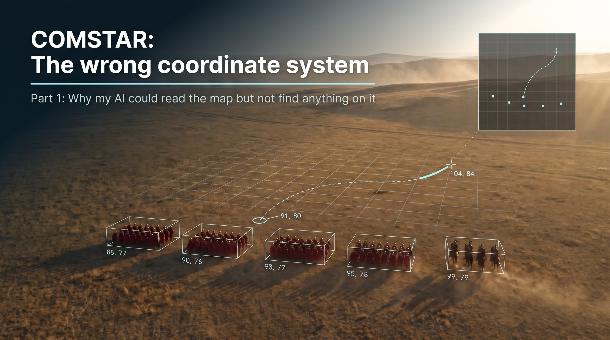

# COMSTAR Game AI

### The wrong coordinate system

**Part 1: why my AI could read the map but not find anything on it**

### 📄 [Download the white paper (PDF)](COMSTAR-GAME-AI_WhitePaper_Part1_v1.0.pdf)

---

## What this is

An open-source AI client for Total War: Rome Remastered. The game is made for human eyes. It shows a 3D perspective view of terrain, cities, and armies. Underneath, the game places everything on a flat map with integer x, y coordinates, and it reports those coordinates through a console command and its own data files.

Four approaches came first: asking a vision model where things are, writing detection rules by hand, training a detector, and assuming a fixed camera model. Each tried to make the machine perceive the human view directly, and none produced a usable result. The approach under test is a translation layer: read the map coordinate under the cursor through the game's console, fit the mapping to screen position, and check it again whenever the camera changes.

This part reports the earlier attempts, the turn, and what would count as proof. It does not claim the translation layer works.

---

## What the paper covers

| Section | Contents |
|---|---|
| **Summary** | The gap between the 3D view and the flat map |
| **1. The problem** | Pixels for a click, map positions for a decision |
| **2. Ground rules** | Screen and input, the console, installed campaign data |
| **3. Ask a vision model** | Coarse coordinates on one test frame |
| **4. Write the rules by hand** | Badges found, plaques and factions missed |
| **5. Train a detector** | A gate the experiment could not pass |
| **6. Assume the camera** | A click sent, a scale never measured |
| **7. Translate instead of perceive** | Console pairs, a homography, a closed loop |
| **8. What would count as proof** | Reader, mapping, and loop bars, and current status |
| **9. Beyond a game** | When translation may beat better perception |
| **10. Where the series goes** | Parts 2, 3, and 4 |
| **Appendices** | Methods and counts; references |

17 pages, 8 figures.

---

## Suggested citation

Lakisic, Z. (2026). *The wrong coordinate system.* COMSTAR Game AI White Paper, part 1, version 1.0.

---

## License

Licensed under [Creative Commons Attribution 4.0 International](https://creativecommons.org/licenses/by/4.0/) (CC BY 4.0).

You are free to share and adapt this material, including commercially, provided you give appropriate credit.

See [LICENSE](LICENSE) and [LICENSE.md](LICENSE.md).

---

## Feedback

Corrections and disagreement are welcome, especially on the reader bar, the homography tolerance, and what the evaluation leaves out. Open an issue or reach out directly.

**Zlatko Lakisic**
[Read on portfolio](https://zlatko-lakisic.github.io/zlatko-lakisic/White-Papers/COMSTAR-Game-AI.html) · [Portfolio home](https://zlatko-lakisic.github.io/zlatko-lakisic/) · [LinkedIn](https://www.linkedin.com/in/zlatko-lakisic/)
